# CfdOF: A Computational fluid dynamics (CFD) workbench for FreeCAD

# Installation von CfdOF

> Unser Team testet nur die Installation auf Windows.

## Linux 

> Es gibt in dem Main-Repository dazu eine Anleitung auf Englisch die genutzt werden kann.
> 
> Main-Repository: [https://github.com/jaheyns/CfdOF](https://github.com/jaheyns/CfdOF)

## iOS
> Die Installation für iOS Nutzer ist im Forum vom Main-Repository erklärt, jedoch weder in dieser Anleitung noch in der im Main-Repository

## Windows

### 1. FreeCAD installieren

> Link um FreeCAD zu downloaden: [https://www.freecadweb.org/downloads.php](https://www.freecadweb.org/downloads.php)

Den Windows 64-Bit Installer auswählen. Nach Download den Installer öffnen.

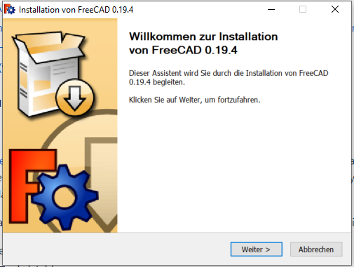

Hier können die Standardeinstellungen übernommen werden. Solange weiter drücken bis das unten gezeigte Fenster kommt.

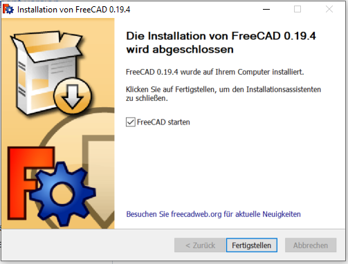

Optional: Checkbox `FreeCAD starten` auswählen

Durch `Fertigstellen` wird FreeCAD installiert und ggfs. direkt geöffnet.

### 2. CfdOF installieren

Über `Tools->Add-on Manager` die Workbench öffnen.

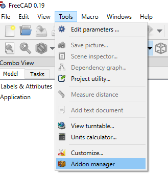

In der Workbench `Plot` auswählen und auf `Install/update selected` um Plot herunterzuladen.

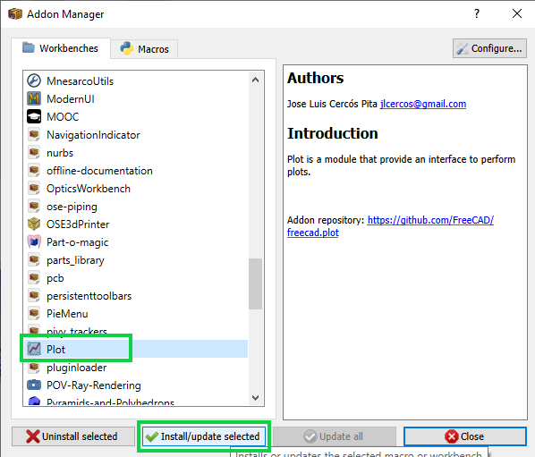

Das gleiche jetzt bei CfdOF machen. Also in der Workbench `CfdOF` auswählen und auf `Install/update selected` klicken.

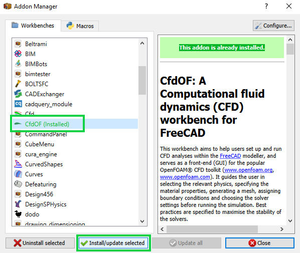

Nach der erfolgreichen Installation von Plot und CfdOF muss FreeCAD neugestartet werden.

Optional: Nach dem Neustart von FreeCAD kann in der Workbench nach geschaut werden, ob alles installiert wurde.

### 3. BlueCfd installieren

> Link um BlueCfd zu downloaden: [https://bluecfd.github.io/Core/](https://bluecfd.github.io/Core/)

Den Link Link zu BlueCfd öffnen. Dieser führt auf eine Webseite und hier durch das Menü, links, `Downloads` auswählen. 

Hier die neuste Version auswählen.
Die `.exe` anklicken, dadurch wird die Datei heruntergeladen. 

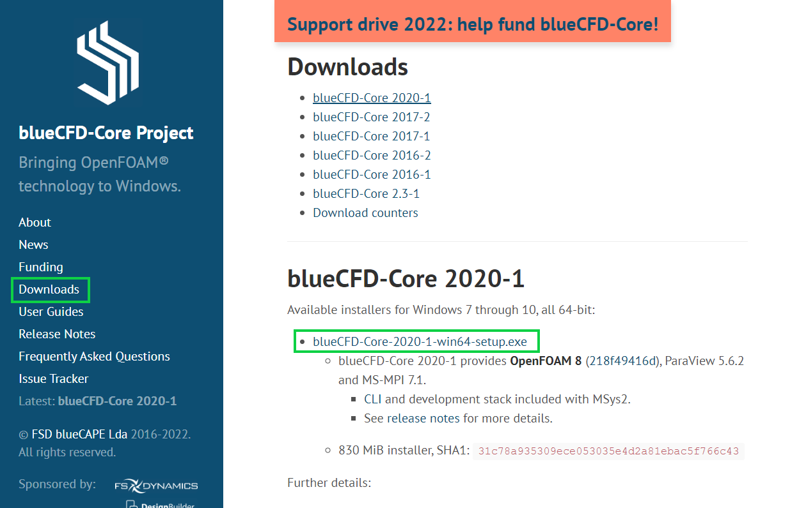

Nach Download die Datei öffnen.

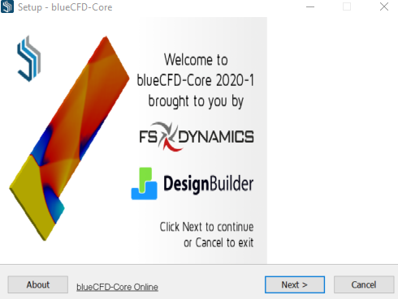

Die Standardeinstellungen können übernommen werden und das License Agreement muss zugestimmt werden. 
Das solange fortführen bis das unten gezeigte Fenster erscheint. 

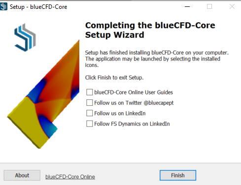

Hier müssen die Checkboxen nicht ausgewählt werden. Dann durch `Finish` die Installation beenden.
Nach der Installation sollten 2 Anwendung-Icons auf dem Desktop erscheinen.

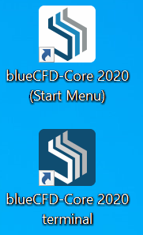

Die Installation von BlueCfd ist dann abgeschlossen.

### 4. Dependencies herunterladen

Über `Edit->Preferences` die Einstellungen öffnen.

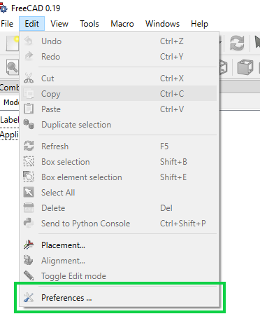

> Am Besten im Vorfeld ein neuen Ordner in eurem persönlichen Verzeichnis für das Projekt erstellen

Unter `CfdOF` das `default-output-directory` zu dem Ordner umändern, der für das Projekt bestimmt ist.

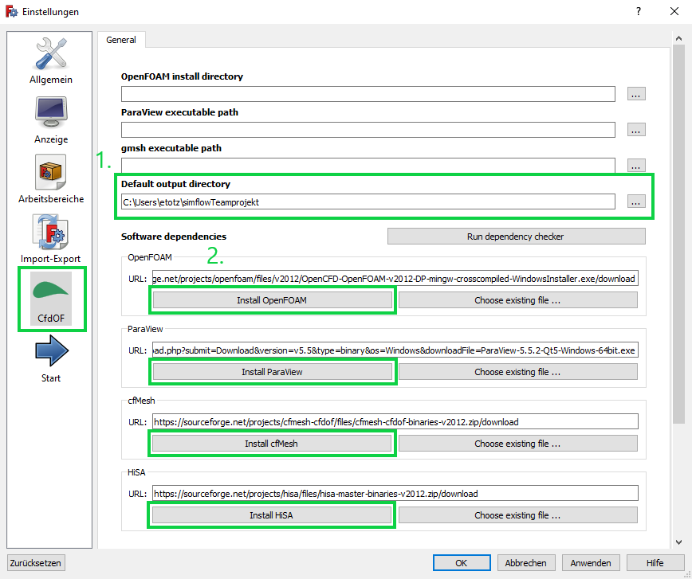

#### OpenFoam installieren

Dann bei `Software Dependecies` durch den Button `Install OpenFOAM` OpenFOAM installieren.
Ein neuen Fenster öffnet sich, für die Installation von OpenFOAM.

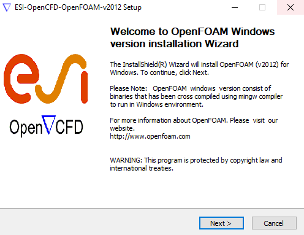

Hier können die Standardeinstellungen übernommen und dem License Agreement muss zugestimmt werden.

Die Installation kann eine Weile dauern.

#### ParaView installieren

Um ParaView zu installieren, wie bei OpenFOAM unter `Software Dependecies` den Button `Install ParaView` anklicken.
Hier sollte sich ebenfalls ein neues Fenster öffnen.

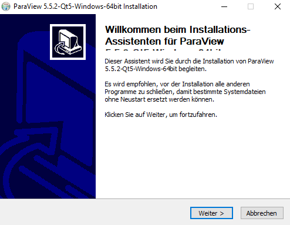

Hier können die Standardeinstellungen übernommen werden.

#### cfMesh und HiSA installieren

cfMesh und HiSA können wie die beiden Dependencies oben, nacheinander durch den Button unter `Software Dependecies` installiert werden.

Den Fortschritt der Installation kann in dem Output Fenster verfolgt werden. 
Erst nach erfolgreicher Installation von cfMesh kann HiSa installiert werden.

#### Pfade aktualisieren

Die Pfade zu dem `OpenFOAM install directory` und `ParaView executable path` müssen in den Preferences noch angegeben werden.

Hier ist das Verzeichnis zu OpenFOAM:

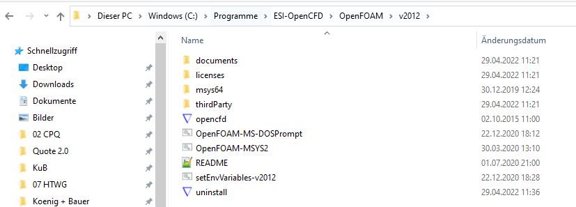

Hier ist die `.exe` Datei für ParaView zu finden:

Die beiden Pfade zu den jeweilgen Verzeichnissen/Dateien in den Preferences mit Hilfe von `...` eintragen.

Dann sollte die Preferences wie folgt aussehen:

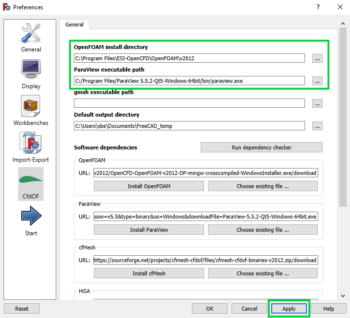

#### Dependency Check

Um zu testen, ob auch alle Dependecies erfolgreich installiert und aufrufbar sind, kann unter `Preferences` das `Run dependency checker` ausgeführt werden.

Im Output-Fenster sollte angezeigt werden, dass alle Dependencies gefunden wurden. (siehe Abbildung)
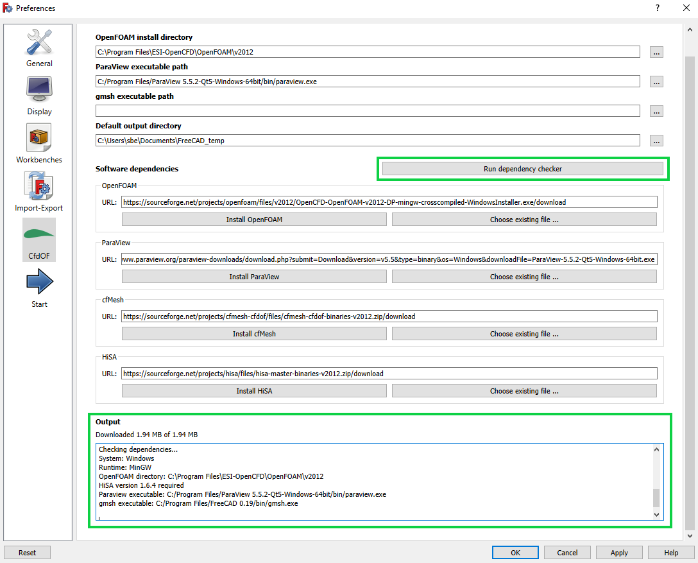

Die Installation von allen relevanten Programmen ist damit abgeschlossen.

# Testing

## simFlow Beispielfall 

Öffnen in FreeCAD von `01-geom.fcmacro` aus dem Ordner `…\cfdOF\demos\Duct` 

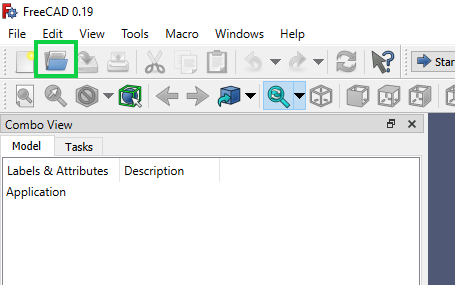

Auf den grünen Pfeil drücken (im Start-Workbench)

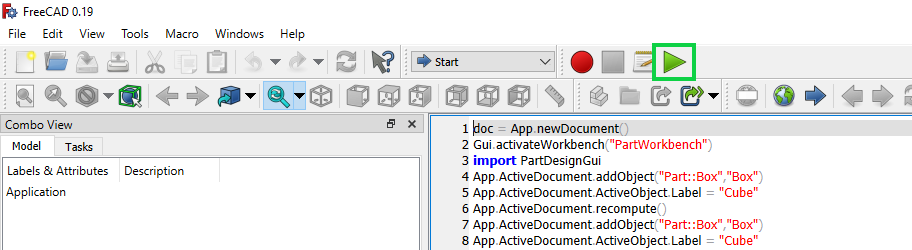

Nun links im Modell `Fusio` anwählen und auf die Workbench `cfdOF` wechseln. 

Über das grüne `A` (s. Screenshot) ein CfdAnalysis-Modell erzeugen  

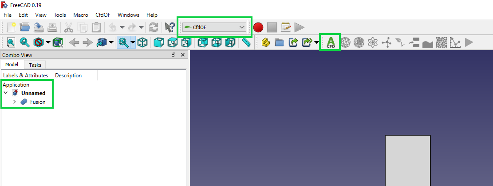

Über das Netzsymbol (s. Screenshot) ein Netz erzeugen: 

hierfür `Write mesh case` drücken. 
Anschließend `Run Mesher`. Über Paraview-Button kann man sich das Netz anschauen. Danach `Close` drücken. 

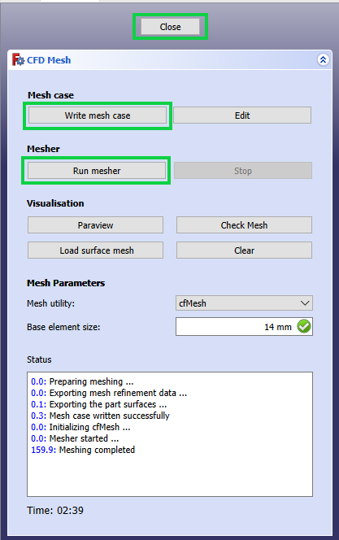

Nun müssten im Modell folgende Unterfelder eingerichtet sein:  

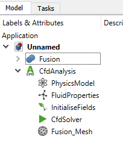

Zunächst muss das `PhysicsModel` gewählt werden, hierfür in der Taskleiste auf das entsprechende Symbol gehen. Nichts ändern und OK drücken. 

 

Anschließend die `FluidProperties` auswählen. Nichts ändern und OK drücken. 

Anschließend die InitialiseFields setzen (Anfangsbedingungen). Wähle über `Specify Values` irgendeine Anfangsgeschwindigkeit, z.B. 100 mm/s für U_x, sonst Null, und irgendeinen Anfangsdruck, z.B. 100000 Pa. Auf OK klicken 

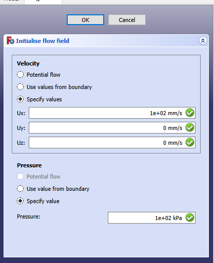

Nun kann der Case gerechnet werden, indem du auf den grünen Pfeil drückst. Erst `Write`,
dann `Run` drücken. In der Konsole sollten die Zwischenergebnisse der Rechnung sehen, 
das ist die Ausgabe von Openfoam. 

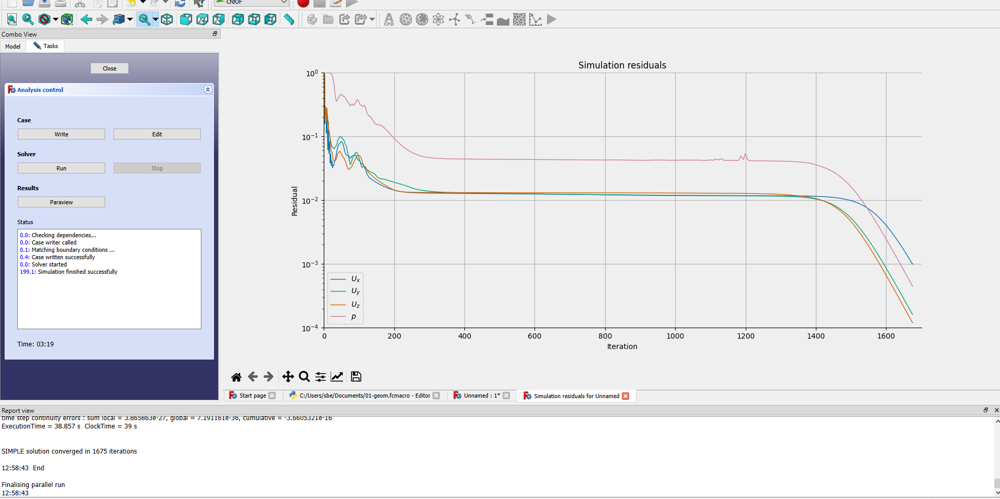

Die Ergebnisse der einzelnen Teilschritte werden entsprechend der Ordner-Struktur von Openfoam in den von dir angegebenen Outputordner geschrieben:  

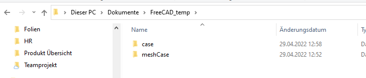

Das Netz z.B. in den Ordner `meshCase`: 

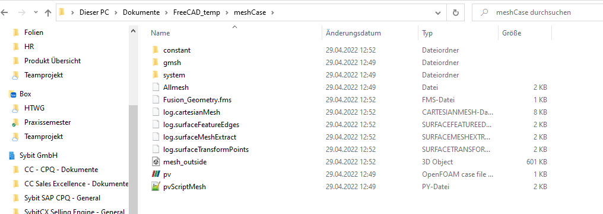

Der Case, den man rechnet, in den Ordner `case`. Hier finden Sie alle Ihre Einstellungen aus der GUI wieder. 

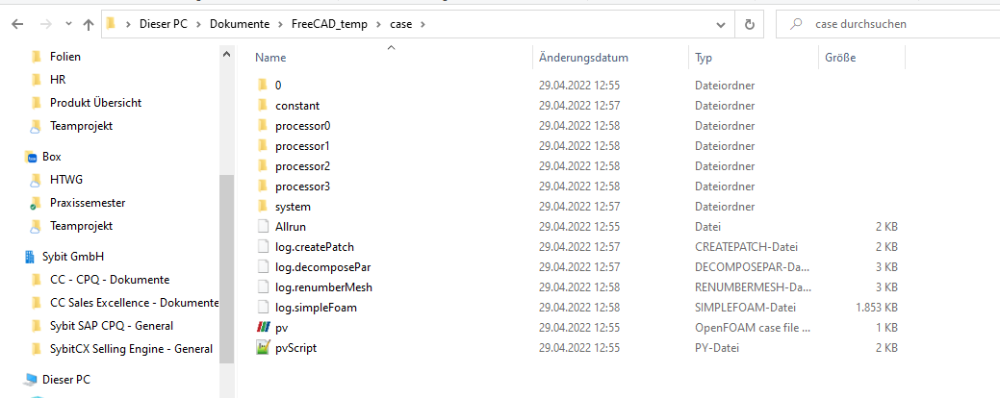
